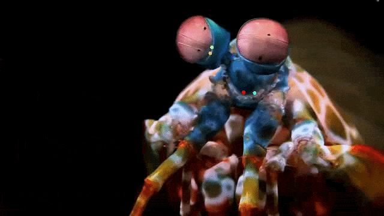

This repository contains the Google Colab notebook (.ipynb file) used to conduct the initial DeepLabCut feasibility check for the project using 20 training frames. The pilot successfully trained a ResNet-50 network to track 8 invariant keypoints with a test RMSE of 3.44 pixels.

 
[Watch the labeled output full video here](https://drive.google.com/file/d/1IOg2pYKO64VzHwlO9WMj5372WY-q5ZIN/view?usp=sharing)
## Data and Annotation
* **8 invariant keypoints:** L_midband_dorsal, R_midband_dorsal; L_midband_ventral, R_midband_ventral; L_eyestalk_peduncle, R_eyestalk_peduncle; L_stalk_base, R_stalk_base  
* **Tool used:** [CVAT](https://www.cvat.ai/) 
* **Dataset size:** 20 manually annotated frames. This small dataset was used to demonstrate the end-to-end DeepLabCut workflow.

## Training Details
* **Environment:** Google Colab 
* **Training duration:** 200 epochs 
* **Goal:** Proof of concept to verify the pipeline from data annotation to model evaluation.

## Model Evaluation
The ResNet-50 model was evaluated using a 95% training split (19 training frames, 1 test frame). Using a 0.6 confidence cutoff, the network achieved the following accuracy metrics:

* **Training Error:** 2.57 pixels
* **Test Error:** 3.72 pixels 
* **Mean Average Precision (mAP):** 100.00%
* **Mean Average Recall (mAR):** 100.00%

These sub-4 pixel error rates on the test split indicate that the model successfully learned to track the annotated points within this proof-of-concept dataset.

## Generalization Note
The final labeled output video is the same source video from which the 20 training frames were extracted. This demonstrates successful "in-domain" tracking for this specific setup. Scaling this model to track subjects robustly across different camera angles, lighting conditions, or new environments would require a larger, more diverse training dataset.
